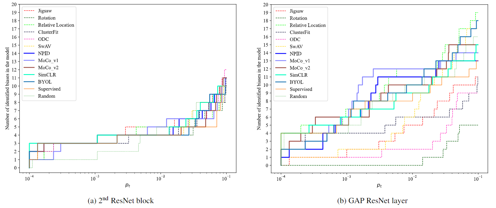

<h1 align="center">
A study on the distribution of social biases in self-supervised learning visual models
</h1>

If you like our [work](https://openaccess.thecvf.com/content/CVPR2022/papers/Sirotkin_A_Study_on_the_Distribution_of_Social_Biases_in_Self-Supervised_CVPR_2022_paper.pdf), please cite us as: 
`
@InProceedings{....
    author    = {Sirotkin, Kirill and Carballeira, Pablo and Escudero-Vi\~nolo, Marcos},
    title     = {A Study on the Distribution of Social Biases in Self-Supervised Learning Visual Models},
    booktitle = {Proceedings of the IEEE/CVF Conference on Computer Vision and Pattern Recognition (CVPR)},
    month     = {June},
    year      = {2022},
    pages     = {10442-10451}
}
`
## Summary 

- We study the association biases acquired by 11 SSL models that share the same ResNet-50 architecture, and vary in terms of pretext task and, thus, their accuracy after transfer learning. The results of this study suggest that the nature of the pretext task influences the number and nature of incorporated biases, and that contrastive models are more prone to acquire  biased associations that are implicit in the data.
    
- We also perform an analysis of biases acquired in the embeddings at different layers of the models, showing that the number and strength of the biases vary at different model depths.  The results of the per-layer analysis suggest that a careful consideration of bias in transfer learning applications can improve the trade-off between bias and accuracy, as the accuracy achieved using embeddings from highly-biased layers is not far from the accuracy achieved by a less-biased embeddings layer.
 
## Run the code

In order to replicate the experiments:
1. Install and activate the environment from **ieat.yml**.
2. Download the test data used in [the original iEAT framework](https://github.com/ryansteed/ieat/tree/master/data) and place it in **./bias_detection_code/data**.
3. Download the weights of the pretrained models from [MMSelfSup](https://github.com/open-mmlab/mmselfsup/blob/master/docs/en/model_zoo.md) and [VISSL](https://github.com/facebookresearch/vissl/blob/main/MODEL_ZOO.md) and
places them in **./bias_detection/code/pretrains**.
4. Edit (according to which models you download) and run **./bias_detection_code/main.py**
5. Run **./process_results.py** to visualize the bias-detection results. 

## Acknowledgment
This study has been supported by the Consejeŕıa de Educacíon e Investigacíon of the Comunidad de Madrid under Project [SI1/PJI/2019-00414](http://www-vpu.eps.uam.es/projects/aiseeme/).
